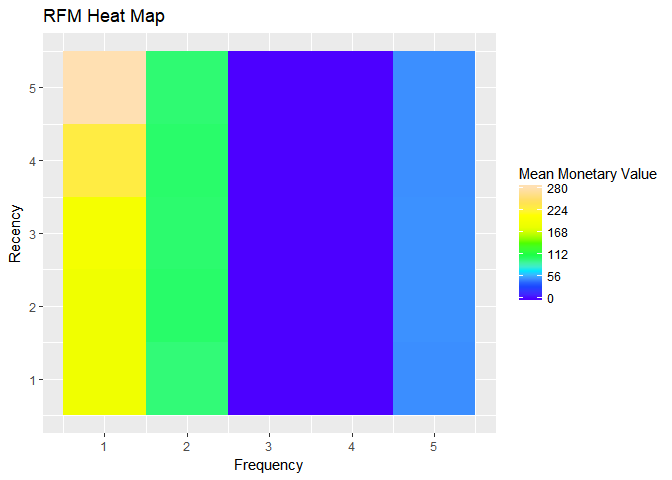
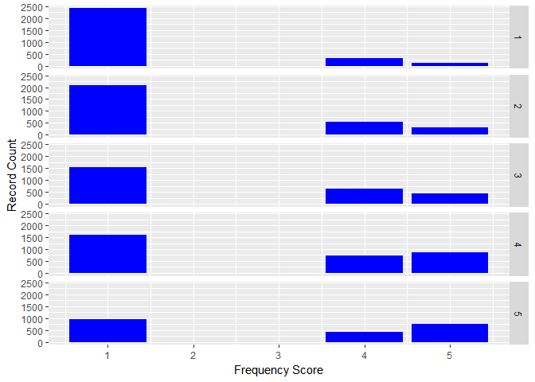
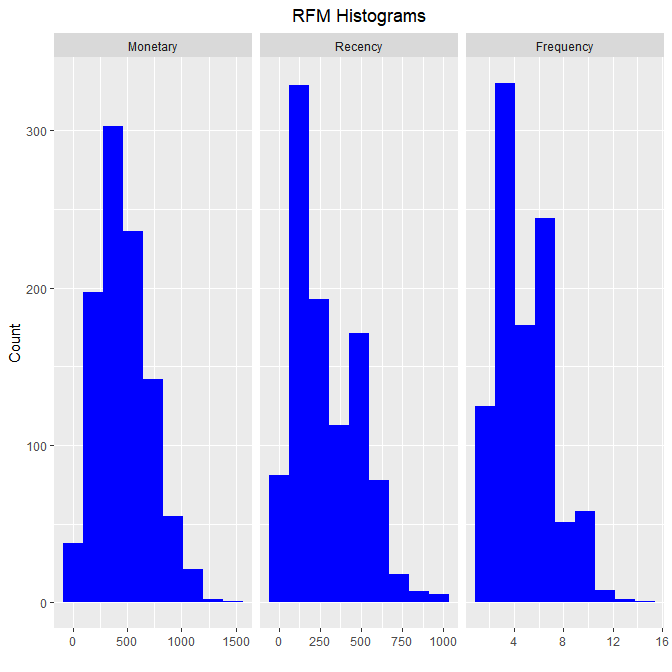
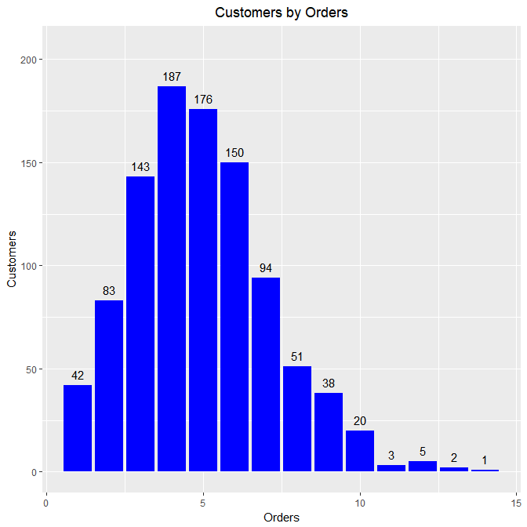
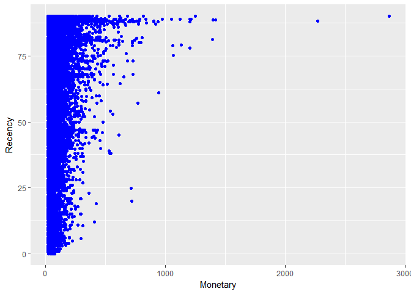
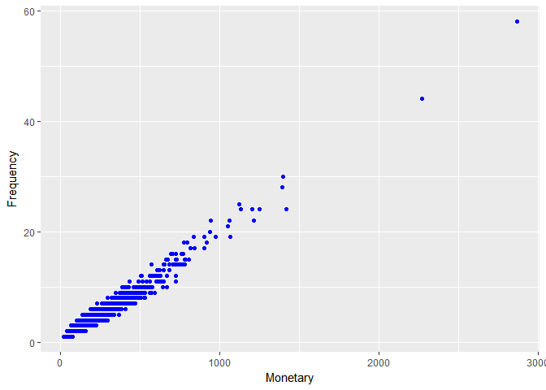

<!-- README.md is generated from README.Rmd. Please edit that file -->
segmentr: Tools for segmentation and clustering 
--------------------------------------------------------------------------------------------

**Author:** [Aravind Hebbali](http://www.aravindhebbali.com)<br/> **License:** [MIT](https://opensource.org/licenses/MIT)

[](https://cran.r-project.org/package=segmentr) [](https://travis-ci.org/rsquaredacademy/segmentr) [](https://ci.appveyor.com/project/rsquaredacademy/segmentr) [](https://cran.r-project.org/package=segmentr)

Overview
--------

Tools for segmentation and clustering

Installation
------------

You can install segmentr from github with:

``` r
# install.packages("devtools")
devtools::install_github("rsquaredacademy/segmentr")
```

Usage
-----

RFM Table
---------

``` r
analysis_date <- lubridate::as_date('2006-12-31', tz = 'UTC')
rfm_result <- rfm_table(rfm_data, customer_id, order_date, revenue, analysis_date)
rfm_result
#> # A tibble: 995 x 9
#>           customer_id date_most_recent recency_days transaction_count amount recency_score frequency_score monetary_score rfm_score
#>                 <chr>           <date>        <dbl>             <dbl>  <dbl>         <int>           <int>          <int>     <dbl>
#>  1 Abbey O'Reilly DVM       2006-06-09          205                 6    472             3               4              3       343
#>  2         Add Senger       2006-08-13          140                 3    340             4               1              2       412
#>  3     Aden Lesch Sr.       2006-06-20          194                 4    405             3               2              3       323
#>  4     Admiral Senger       2006-08-21          132                 5    448             4               3              3       433
#>  5     Agness O'Keefe       2006-10-02           90                 9    843             5               5              5       555
#>  6      Aileen Barton       2006-10-08           84                 9    763             5               5              5       555
#>  7     Ailene Hermann       2006-03-25          281                 8    699             3               5              5       355
#>  8  Aiyanna Bruen PhD       2006-04-29          246                 4    157             3               2              1       321
#>  9    Ala Schmidt DDS       2006-01-16          349                 3    363             2               1              2       212
#> 10      Alannah Borer       2005-04-21          619                 4    196             1               2              1       121
#> # ... with 985 more rows
```

Heat Map
--------

``` r
rfm_heatmap(rfm_result)
```



Bins Count
----------

``` r
rfm_bar_chart(rfm_result)
```



Histogram
---------

``` r
rfm_histograms(rfm_result)
```



Customers by Orders
-------------------

``` r
rfm_order_dist(rfm_result)
```



Scatter Plots
-------------

### Recency vs Monetary Value

``` r
rfm_rm_plot(rfm_result)
```



### Frequency vs Monetary Value

``` r
rfm_fm_plot(rfm_result)
```



### Recency vs Frequency

``` r
rfm_rf_plot(rfm_result)
```


Please note that this project is released with a [Contributor Code of Conduct](CONDUCT.md). By participating in this project you agree to abide by its terms.
